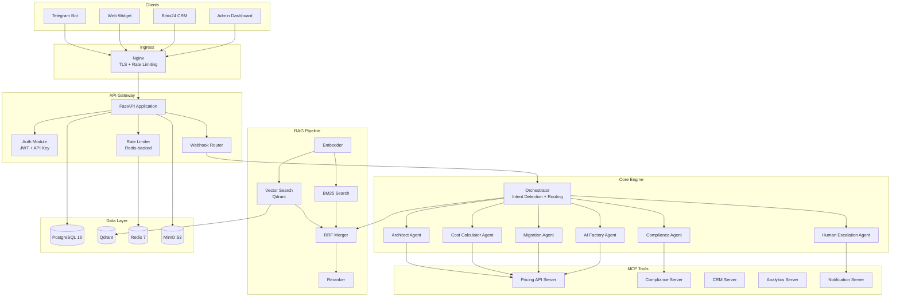

# Architecture Overview

## System Architecture Diagram



---

## Architecture Pattern: Distributed Monolith

The system follows a **Distributed Monolith (Monorepo)** pattern: a single deployable unit with well-defined internal module boundaries, containerized via Docker Compose.

### Why This Pattern

| Factor | Decision Rationale |
|--------|-------------------|
| Team size | 3 developers -- microservices overhead is not justified |
| MVP timeline | 3-month delivery -- monolith simplicity enables faster iteration |
| Isolation | Docker Compose containers provide sufficient service isolation |
| Future flexibility | Clear module boundaries allow extraction to microservices later |
| Agent architecture | MCP-based agents naturally decouple business logic from infrastructure |

### Module Boundaries

```
src/
  api/            HTTP layer (routes, schemas, middleware)
  orchestrator/   Intent detection, agent routing, confidence scoring
  agents/         Agent configurations (not code -- config files)
  rag/            RAG pipeline (embedding, search, reranking)
  mcp/            MCP tool server implementations
  models/         SQLAlchemy ORM models
  services/       Business logic (lead qualification, TCO, escalation)
  utils/          Shared utilities (logging, config, rate limiting)
  config/         Application settings
```

Each module communicates through well-defined Python interfaces. No module directly imports another module's internal classes.

---

## Component Descriptions

### API Gateway (FastAPI)

The entry point for all HTTP and WebSocket traffic. Responsibilities:

- **Routing:** RESTful endpoints for conversations, dashboard, authentication, and webhooks
- **Authentication:** JWT tokens for the admin dashboard; API keys (X-API-Key header) for external integrations
- **Rate Limiting:** Redis-backed sliding window algorithm with per-user and global limits
- **CORS:** Configured for the admin dashboard and web widget origins
- **Webhook Processing:** Receives and validates Telegram updates, web widget messages, and CRM events

### Orchestrator

The brain of the system. Receives user messages and decides how to handle them:

1. **Intent Detection:** Classifies the user message into intent categories (architecture, cost, compliance, migration, ai_factory, general)
2. **Agent Selection:** Routes to the appropriate specialist agent based on intent and conversation context
3. **Context Management:** Maintains conversation state across turns, including identified requirements and previous agent outputs
4. **Response Assembly:** Formats the agent's raw output for the specific channel (Telegram markdown, web widget HTML, CRM structured data)
5. **Confidence Scoring:** Calculates an aggregate confidence score from RAG retrieval quality, LLM response certainty, and tool output validity. Below 0.6 triggers human escalation.

### Agent Layer

Six specialist agents, each defined by configuration rather than code:

| Agent | System Prompt | MCP Tools | RAG Collections |
|-------|---------------|-----------|-----------------|
| Architect | `prompts/architect.md` | service_catalog, architecture_templates, sizing_calculator | cloud_ru_docs, reference_architectures |
| Cost Calculator | `prompts/cost_calculator.md` | pricing_lookup, discount_calculator, tco_templates | pricing_data, competitor_pricing |
| Compliance | `prompts/compliance.md` | compliance_checker, certification_lookup | compliance_docs, regulatory_updates |
| Migration | `prompts/migration.md` | migration_assessor, timeline_generator | migration_playbooks, case_studies |
| AI Factory | `prompts/ai_factory.md` | gpu_catalog, ml_sizing, benchmark_lookup | ai_factory_docs, gpu_specs |
| Human Escalation | `prompts/human_escalation.md` | sa_availability, calendar_booking, notification_sender | -- |

Adding a new agent requires only creating a prompt file, registering it in `agent_configs`, and restarting the API. No code changes.

### RAG Pipeline

Retrieval-Augmented Generation with hybrid search for maximum retrieval quality:

1. **Query Embedding:** The user query is converted to a 1,536-dimension vector using text-embedding-3-small (or e5-large-v2 for local deployment)
2. **Vector Search:** Qdrant performs approximate nearest neighbor search on the tenant's collections
3. **BM25 Search:** Keyword-based search using Qdrant's built-in full-text index
4. **Reciprocal Rank Fusion (RRF):** Merges results from vector and BM25 searches, combining semantic and lexical relevance
5. **Reranking (Optional):** A cross-encoder model re-scores the merged results for higher precision
6. **Context Injection:** Top-k results are injected into the agent's prompt as context

### MCP Tool Layer

Five MCP (Model Context Protocol) servers provide agents with structured access to external APIs:

| Server | Tools | Purpose |
|--------|-------|---------|
| cloud-ru-api-server | pricing_lookup, service_catalog, sizing_calculator | Cloud.ru product and pricing data |
| compliance-server | compliance_checker, certification_lookup | 152-FZ rules, FSTEC checks |
| analytics-server | consultation_metrics, roi_calculator | Internal analytics and reporting |
| crm-server | lead_create, deal_update, contact_sync | Bitrix24 / amoCRM integration |
| notification-server | send_telegram, send_email, sa_notify | Notifications and escalation alerts |

MCP servers run as separate processes and communicate via stdio or HTTP. They are stateless and independently testable.

### Data Layer

| Store | Technology | Data Stored | Role |
|-------|-----------|-------------|------|
| PostgreSQL 16 | Relational DB | Tenants, conversations, messages, leads, agent configs, daily metrics | Primary persistent storage, ACID transactions |
| Qdrant | Vector DB | Document embeddings, BM25 indexes | RAG retrieval, hybrid search |
| Redis 7 | In-memory store | Session cache, rate limit counters, message queue, Pub/Sub events | Caching, rate limiting, real-time events |
| MinIO | S3-compatible storage | Document corpus originals, generated PDFs, backup files | Object storage for files |

---

## Data Model

### Entity Relationship Overview

```
tenants
  |-- conversations (1:N)
  |     |-- messages (1:N)
  |     |-- lead (1:1, optional)
  |-- leads (1:N)
  |-- agent_configs (1:N)
  |-- daily_metrics (1:N)
```

### Core Tables

| Table | Primary Key | Key Columns | Purpose |
|-------|-------------|-------------|---------|
| `tenants` | UUID | name, slug, api_key_hash, plan, config (JSONB) | Multi-tenant isolation |
| `conversations` | UUID | tenant_id, channel, status, context (JSONB) | Conversation sessions |
| `messages` | UUID | conversation_id, role, agent_type, content, metadata (JSONB) | Individual messages |
| `leads` | UUID | tenant_id, conversation_id, contact (JSONB), qualification, estimated_deal_value | Qualified leads |
| `agent_configs` | UUID | tenant_id, agent_type, confidence_threshold, tools[], rag_collections[] | Per-tenant agent settings |
| `daily_metrics` | UUID | tenant_id, date, total_consultations, leads_generated, escalations, top_intents (JSONB) | Aggregated analytics |

### Multi-Tenant Isolation

Every table with user data includes a `tenant_id` foreign key. All database queries filter by `tenant_id` to ensure strict data isolation between tenants. Qdrant collections are also segmented by tenant slug.

---

## Security Architecture

### Authentication

| Method | Use Case | Implementation |
|--------|----------|----------------|
| JWT (HS256) | Admin dashboard | Email/password login, 60-minute token expiry, refresh tokens |
| API Key | External integrations | X-API-Key header, bcrypt-hashed in the `tenants` table |
| Telegram signature | Telegram webhook | X-Telegram-Bot-Api-Secret-Token header validation |

### Authorization (RBAC)

| Role | Dashboard | Agent Config | Conversations | Metrics | Tenant Management |
|------|-----------|-------------|---------------|---------|-------------------|
| superadmin | Full | Full | Full | Full | Full |
| admin | Full | Full | Full | Full | None |
| agent_manager | None | Full | Read only | Full | None |
| viewer | Read only | None | None | Read only | None |

### Data Protection

- **TLS 1.3** on all external connections (Nginx termination)
- **Docker internal networks** for inter-service communication (no external exposure)
- **bcrypt** for API key hashing
- **Environment variables** for all secrets (never in code)
- **PII anonymization** after 90 days via automated background job
- **152-FZ compliance** through Moscow DC data residency

### Rate Limiting

| Endpoint | Limit | Window |
|----------|-------|--------|
| POST /api/v1/conversations/*/messages | 30 requests | 60 seconds per user |
| POST /api/v1/webhooks/telegram | 100 requests | 60 seconds global |
| GET /api/v1/dashboard/* | 60 requests | 60 seconds per user |
| POST /api/v1/auth/login | 5 requests | 60 seconds per IP |
| Global | 1,000 requests | 60 seconds |

---

## Scalability Considerations

### Current Architecture Limits (Single Server)

| Metric | Estimated Capacity |
|--------|-------------------|
| Concurrent users | ~100 |
| Consultations per day | ~1,000 |
| RAG corpus size | ~100,000 documents |
| Message throughput | ~50 messages/second |

### Bottleneck Analysis

| Component | Bottleneck | Mitigation |
|-----------|-----------|------------|
| LLM API | Latency (2-10s per call) | Streaming responses, common query caching |
| RAG retrieval | Embedding generation latency | Pre-computed embeddings, batch indexing |
| PostgreSQL | Write-heavy message logging | Async writes via Redis queue |
| Qdrant | Large corpus search latency | Collection-per-tenant partitioning, filtered search |

### Horizontal Scaling Path

1. **FastAPI:** Multiple replicas behind Nginx load balancer
2. **PostgreSQL:** PgBouncer for connection pooling, read replicas for dashboard queries
3. **Qdrant:** Cluster mode with sharding by tenant
4. **Redis:** Redis Cluster for HA
5. **Background Jobs:** Separate Celery worker containers

---

## Architecture Decision Records (ADRs)

### ADR-001: Distributed Monolith over Microservices

**Decision:** Single deployable unit with internal module boundaries.
**Rationale:** 3-person team, 3-month MVP timeline. Microservices add networking, observability, and deployment complexity that cannot be sustained at this scale. Python package boundaries allow future extraction.

### ADR-002: Qdrant over Pinecone / Weaviate

**Decision:** Self-hosted Qdrant in a Docker container.
**Rationale:** Open-source, built-in BM25 hybrid search, collection-level multi-tenancy, Rust performance. Pinecone is cloud-only (not 152-FZ compliant). Weaviate is heavier and has a steeper operational burden.

### ADR-003: MCP for Agent Tool Access

**Decision:** Model Context Protocol servers for the tool layer.
**Rationale:** Industry standard protocol, natively supported by Claude, clean separation between agent logic and tool implementation. Each tool group runs as an independent MCP server process.

### ADR-004: FastAPI over Django / Flask

**Decision:** FastAPI with Pydantic v2.
**Rationale:** Native async (critical for LLM streaming), automatic OpenAPI documentation, type-safe request validation, WebSocket support for the web widget. Django is too heavy for an API-first product. Flask lacks async and type safety.

### ADR-005: PostgreSQL + Redis over MongoDB

**Decision:** PostgreSQL 16 as primary database, Redis 7 for caching.
**Rationale:** ACID compliance for lead and financial data, JSONB for flexible schemas (conversation context), strong query capabilities for analytics. Redis handles caching and rate limiting. MongoDB adds operational complexity without a clear benefit for this data model.
