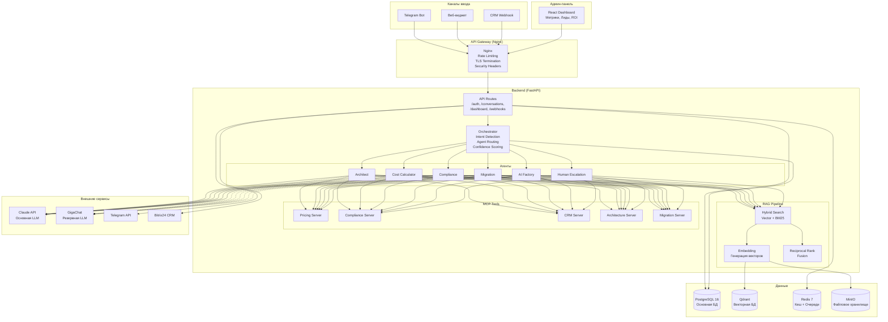

# Архитектура системы

## Обзор

AI-Консультант Cloud.ru построен по паттерну **Distributed Monolith** (распределенный монолит) в рамках монорепозитория. Все компоненты развертываются через Docker Compose на одном сервере, но логически изолированы и взаимодействуют через четко определенные интерфейсы.

---

## Диаграмма архитектуры



---

## Компоненты системы

### API Gateway (Nginx)

Единая точка входа для всех внешних запросов.

- **TLS-терминация**: SSL-сертификат обслуживается на уровне Nginx.
- **Rate Limiting**: три зоны -- API (30 req/min), Auth (5 req/min), Webhooks (100 req/min).
- **Security Headers**: X-Content-Type-Options, X-Frame-Options, X-XSS-Protection, HSTS.
- **Проксирование**: API-запросы на FastAPI-бекенд, статика -- на React-фронтенд.

### Orchestrator

Центральный координатор обработки запросов.

- **Intent Detection**: определение намерения пользователя (архитектура, TCO, compliance, миграция, AI).
- **Agent Routing**: маршрутизация к соответствующему агенту на основе интента.
- **Confidence Scoring**: оценка уверенности ответа. При значении ниже 0.6 -- автоматическая эскалация.
- **Context Management**: поддержка контекста многошагового диалога.

### Agent Layer

6 специализированных агентов. Каждый агент определяется конфигурацией, а не кодом:

- **Системный промпт** -- файл в `prompts/*.md`.
- **RAG-коллекции** -- список коллекций Qdrant для поиска.
- **MCP-инструменты** -- набор API-инструментов, доступных агенту.
- **Порог уверенности** -- настраивается per-tenant в таблице `agent_configs`.

### RAG Pipeline

Гибридный поиск по корпусу документации Cloud.ru.

1. **Embedding**: генерация векторных представлений запроса и документов.
2. **Vector Search**: поиск по близости в Qdrant (cosine similarity).
3. **BM25**: лексический поиск по ключевым словам.
4. **Reciprocal Rank Fusion (RRF)**: объединение результатов двух методов для повышения качества.

### MCP Tools

5 MCP-серверов (Model Context Protocol) для предоставления агентам доступа к внешним данным:

| MCP-сервер | Назначение |
|------------|------------|
| Pricing | Актуальные тарифы Cloud.ru, калькулятор TCO |
| Compliance | Нормативные требования, шаблоны документов |
| CRM | Создание и обновление лидов в Bitrix24/amoCRM |
| Architecture | Каталог сервисов, шаблоны архитектуры |
| Migration | Матрицы совместимости, инструменты оценки |

### Data Layer

| Хранилище | Роль | Данные |
|-----------|------|--------|
| PostgreSQL 16 | Основная СУБД | Тенанты, разговоры, сообщения, лиды, метрики, конфигурации |
| Qdrant | Векторная БД | Эмбеддинги документов, коллекции per-tenant |
| Redis 7 | Кеш и очереди | Кеш ответов LLM, rate limiting, сессии |
| MinIO | Файловое хранилище | Документы корпуса, вложения, экспорт |

---

## Модель данных

### Таблицы

```
tenants
├── id (UUID, PK)
├── name (VARCHAR 255)
├── slug (VARCHAR 100, UNIQUE)
├── config (JSONB)
├── api_key_hash (VARCHAR 255)
├── plan (VARCHAR 50, default: "pilot")
├── created_at, updated_at

conversations
├── id (UUID, PK)
├── tenant_id (UUID, FK → tenants)
├── channel (VARCHAR 20: telegram|web|api)
├── channel_user_id (VARCHAR 255)
├── status (VARCHAR 20: active|completed|escalated)
├── context (JSONB)
├── created_at, updated_at
│
├── INDEX idx_conversations_tenant (tenant_id)
├── INDEX idx_conversations_status (status)
└── INDEX idx_conversations_channel_user (channel, channel_user_id)

messages
├── id (UUID, PK)
├── conversation_id (UUID, FK → conversations)
├── role (VARCHAR 20: user|assistant|system)
├── agent_type (VARCHAR 30, nullable)
├── content (TEXT)
├── metadata (JSONB)
├── created_at
│
├── INDEX idx_messages_conversation (conversation_id)
└── INDEX idx_messages_created (created_at)

leads
├── id (UUID, PK)
├── tenant_id (UUID, FK → tenants)
├── conversation_id (UUID, FK → conversations)
├── contact (JSONB: {name, email, phone, company})
├── qualification (VARCHAR 20: cold|warm|qualified|hot)
├── intent (VARCHAR 30)
├── estimated_deal_value (NUMERIC 15,2)
├── architecture_summary (TEXT)
├── tco_data (JSONB)
├── compliance_requirements (ARRAY[VARCHAR])
├── crm_external_id (VARCHAR 255)
├── created_at, updated_at
│
├── INDEX idx_leads_tenant (tenant_id)
└── INDEX idx_leads_qualification (qualification)

agent_configs
├── id (UUID, PK)
├── tenant_id (UUID, FK → tenants)
├── agent_type (VARCHAR 30)
├── system_prompt (TEXT)
├── confidence_threshold (NUMERIC 3,2, default: 0.6)
├── max_turns (INTEGER, default: 20)
├── rag_collections (ARRAY[VARCHAR])
├── tools (ARRAY[VARCHAR])
├── enabled (BOOLEAN, default: true)
│
└── UNIQUE (tenant_id, agent_type)

daily_metrics
├── id (UUID, PK)
├── tenant_id (UUID, FK → tenants)
├── date (DATE)
├── total_consultations (INTEGER)
├── avg_response_time_ms (INTEGER)
├── leads_generated (INTEGER)
├── escalations (INTEGER)
├── satisfaction_avg (NUMERIC 3,2)
├── top_intents (JSONB)
│
└── UNIQUE (tenant_id, date)
```

### Связи

- `Tenant` 1:N `Conversation`, `Lead`, `AgentConfig`, `DailyMetric`
- `Conversation` 1:N `Message`, 1:1 `Lead`

---

## Архитектура безопасности

### Аутентификация

- **Админ-панель**: JWT-токены (HS256, срок жизни 60 мин).
- **API-клиенты**: API-ключ в заголовке `X-API-Key` (bcrypt-хеш в таблице `tenants`).
- **Telegram**: верификация заголовка `X-Telegram-Bot-Api-Secret-Token`.

### Авторизация (RBAC)

| Роль | Права |
|------|-------|
| superadmin | Полный доступ, управление тенантами |
| admin | Управление агентами, просмотр всех данных тенанта |
| agent_manager | Настройка агентов, просмотр разговоров |
| viewer | Только чтение дашбордов и метрик |

### Мультитенантность

Все SQL-запросы фильтруются по `tenant_id`. Коллекции Qdrant создаются отдельно для каждого тенанта. Redis-ключи содержат префикс тенанта.

### Шифрование

- TLS 1.2/1.3 для всех внешних соединений (Nginx).
- AES-256-GCM для чувствительных данных в БД.
- bcrypt для хешей паролей и API-ключей.

---

## Масштабирование

### Текущая архитектура (один сервер)

Система рассчитана на 100-500 консультаций в день на одном сервере с рекомендуемой конфигурацией (8 vCPU / 32 ГБ RAM).

### Горизонтальное масштабирование

При необходимости обработки более 500 консультаций в день:

1. **API**: увеличение количества uvicorn workers (параметр `--workers` в CMD).
2. **PostgreSQL**: переход на управляемый сервис (Cloud.ru Managed PostgreSQL) с репликами чтения.
3. **Qdrant**: кластерный режим с шардированием коллекций.
4. **Redis**: Redis Sentinel или Redis Cluster для отказоустойчивости.
5. **Разделение сервисов**: вынос PostgreSQL, Qdrant, Redis на отдельные серверы.

---

## Ключевые архитектурные решения (ADR)

| Решение | Обоснование |
|---------|-------------|
| Distributed Monolith вместо микросервисов | Простота развертывания на VPS, нет оверхеда service mesh |
| Агенты как конфиг, а не код | Быстрое добавление агентов без программирования |
| Гибридный поиск (Vector + BM25 + RRF) | Лучшее качество поиска по сравнению с одним методом |
| MCP для инструментов | Стандартизированный протокол, легко добавлять новые инструменты |
| PostgreSQL + Qdrant (а не только PostgreSQL с pgvector) | Qdrant дает лучшую производительность на больших коллекциях |
| Claude как основная LLM, GigaChat как резерв | Качество Claude выше, GigaChat -- для 152-ФЗ fallback |
| Docker Compose вместо Kubernetes | Достаточно для целевой нагрузки, проще администрирование |
